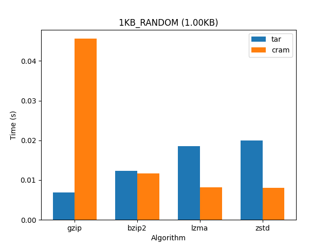
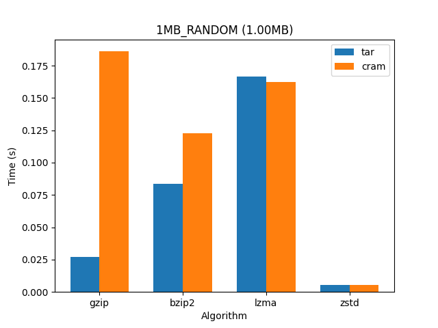
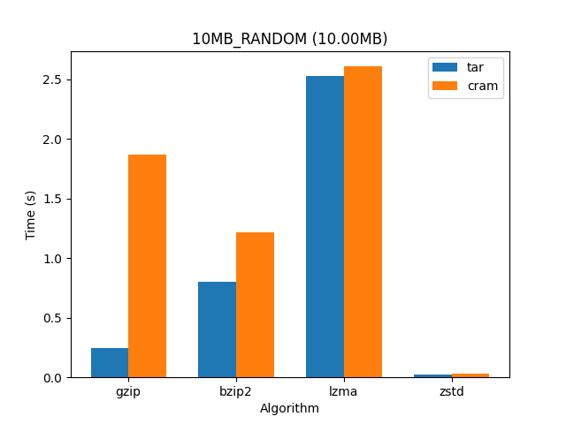
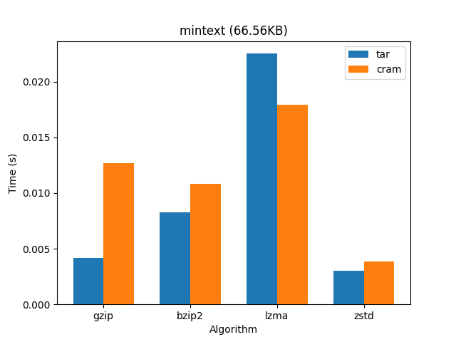
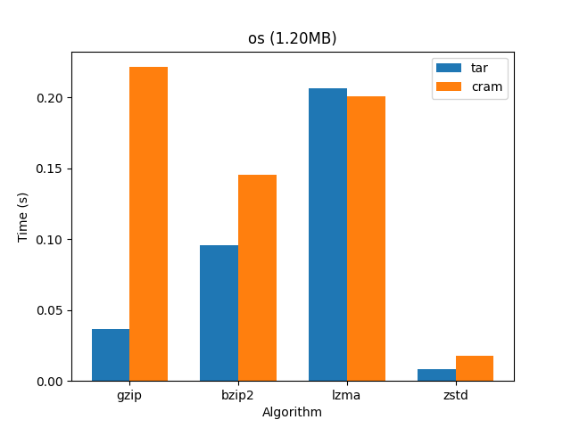
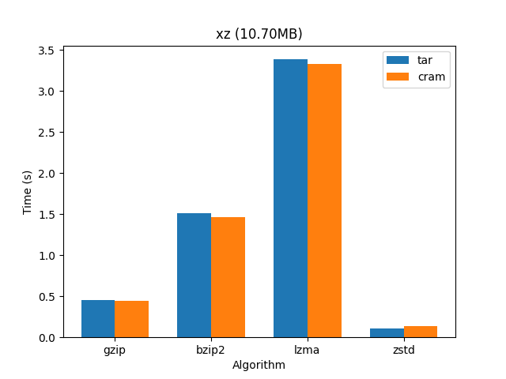

## cram
> A one stop shop for (un)archiving and (de)compressing files.
## Benchmarking
Full details can be found in [`benchmark.json`](benchmark.json).

Benchmarks are computed using the `cram` and `tar` binaries, unoptimized. The same compression binaries are used for both, to ensure a fair comparison (the Rust libraries are significantly less effiecient).

But here are some summary graphs:

